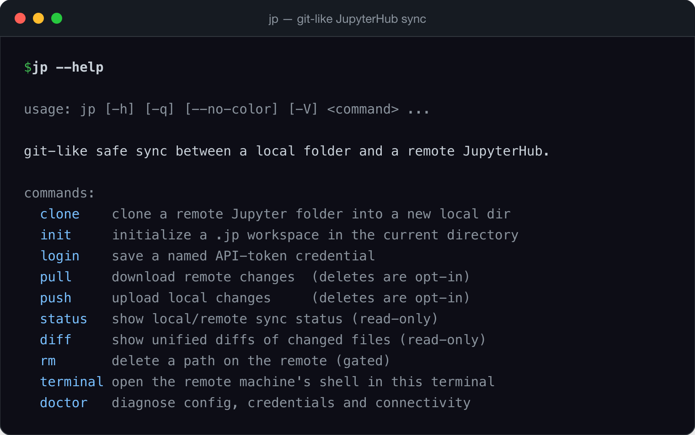
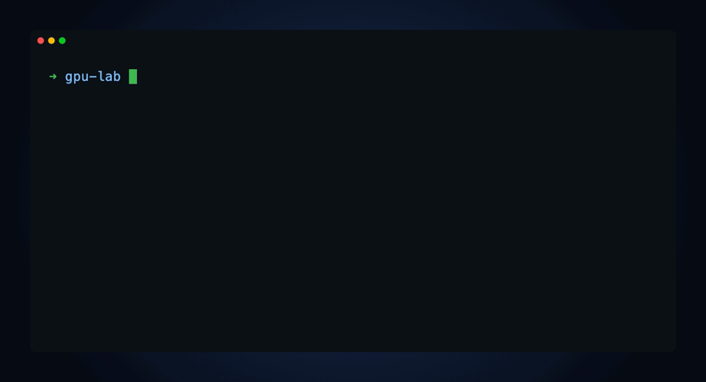

<h1 align="center">jpsync</h1>

<p align="center">
  <em>A git-like CLI to safely sync local folders with a remote JupyterHub — zero dependencies, pure Python.</em>
</p>

<p align="center">
  <a href="https://github.com/pehqge/jpsync/actions/workflows/ci.yml"></a>
  <a href="https://pypi.org/project/jpsync/"></a>
  
  <a href="https://github.com/pehqge/jpsync/blob/main/LICENSE"></a>
  
  <a href="https://doi.org/10.5281/zenodo.20552614"></a>
  <a href="https://github.com/sponsors/pehqge"></a>
</p>

<p align="center">
  
</p>

---

`jp` keeps a local folder in sync with a directory on a **JupyterHub** server —
the way `git` keeps you in sync with a remote. You edit notebooks and scripts on
your laptop, `jp push` to send them up, run your training on the server's GPUs,
and `jp pull` the results back down.

It talks to the JupyterHub REST API directly, has **zero third-party
dependencies** (pure Python standard library), and runs anywhere Python 3.9+
runs — macOS, Windows, Linux.


<p align="center">
  
</p>

## Why jp?

- **Git-like workflow** — `jp clone`, `jp status`, `jp push`, `jp pull`. Same muscle memory.
- **Safe by default** — on a *shared* research machine, jp never deletes remote files unless you explicitly turn that on, and even then it asks you file-by-file. Conflicts are never silently overwritten.
- **Zero dependencies** — one install, no dependency hell; ships as a wheel, a single `.pyz`, or a standalone binary.
- **Cross-platform** — macOS, Windows, Linux; Python 3.9 → 3.13.

---

## Installation

**Recommended — [pipx](https://pipx.pypa.io):**
```bash
pipx install jpsync
```

**Or with [uv](https://docs.astral.sh/uv/):**
```bash
uv tool install jpsync
```

Both install the `jp` command in an isolated environment and put it on your
`PATH`. Then check it works:
```bash
jp --version
```

> If `jp: command not found`, run `pipx ensurepath` (or `uv tool update-shell`)
> and reopen your terminal.

<details>
<summary>Other ways to install</summary>

**No Python required** — standalone binary (macOS / Linux):
```bash
curl -fsSL https://raw.githubusercontent.com/pehqge/jpsync/main/scripts/install.sh | sh
```

**No Python required** — standalone binary (Windows, PowerShell):
```powershell
powershell -ExecutionPolicy ByPass -c "irm https://raw.githubusercontent.com/pehqge/jpsync/main/scripts/install.ps1 | iex"
```

**Single file** — grab `jp.pyz` from the
[latest release](https://github.com/pehqge/jpsync/releases/latest) and run it
with any Python 3.9+:
```bash
python jp.pyz --help
```

**From source** (latest `main`):
```bash
pipx install "git+https://github.com/pehqge/jpsync"
```

</details>

---

## Getting started

### 1. Get your JupyterHub API token

`jp` authenticates with a personal API token from your JupyterHub.

1. Open your JupyterHub in a browser and log in (e.g. `https://jupyter.example.com`).
2. Go to the **Token** page — usually the **Token** link in the top bar, or
   visit `https://<your-hub>/hub/token` directly.
3. Type a note (e.g. `jp`), leave the scopes blank (full access to what *you*
   can already do), and click **Request new API token**.
4. **Copy the token now** — JupyterHub shows it only once.

> Security: the token is like a password for your account. `jp` stores only the
> *path* to a token file, never the token value, and never logs or commits it.

### 2. Log in with `jp login`

Run `jp login` and follow the prompts. It asks for a short name, walks you
through getting the token, then you paste it (your input stays **hidden**).
Credentials are saved **globally** by default (usable from anywhere); pass
`--local` to keep it only in the current workspace:

```console
$ jp login
Name this server/credential (e.g. myserver): myserver
To get a JupyterHub API token:
  1. Open your JupyterHub in a browser and log in.
  2. Go to the Token page (the 'Token' link, or <your-hub>/hub/token).
  3. Click 'Request new API token' and copy it (it is shown only once).

Paste your API token (input hidden):
✓ saved global credential 'myserver'
```

**Everything stays on your machine.** `jp` writes the token to a private file
(permissions `600`) under `~/.config/jp/` (or the workspace's `.jp/` for a local
credential) and records only the credential's *name* in config — never the token
value. The token is never printed, logged, committed, or sent anywhere except as
the `Authorization` header to your own hub.

Run `jp login` again any time to add another server — keep as many credentials as
you like and pick one when you clone. See [Credentials](#credentials--jp-login).

### 3. Make sure your server is running

`jp` talks to your *single-user* server, so it must be started: open JupyterHub
and, if needed, click **Start My Server**. (`jp doctor` will tell you if it's
stopped.)

### 4. Clone your folder

Copy the URL of the folder from your browser's address bar — the `lab/tree/...`
URL works directly:

```bash
jp clone https://jupyter.example.com/user/<you>/lab/tree/your-folder
cd your-folder
```

That creates a `your-folder/` folder with a `.jp/` workspace inside (like `.git/`)
and downloads the remote tree. If you saved more than one credential, `jp` asks
which one to use; with a single one it just uses it. The choice is remembered in
the workspace (`jp clone … --credential <name>` to skip the prompt).

### 5. Work like git

```bash
jp status          # what changed, locally vs the server
jp push            # send local changes up
jp pull            # bring remote changes (e.g. training output) down
```

That's it. From any subdirectory of the workspace, `jp` finds its root
automatically (it walks up looking for `.jp/`, stopping at your home folder).

### Bonus: a shell on the server

Need to actually *run* something on the remote box — install a package, kick off
training, poke around? Run `jp terminal` from your workspace and your terminal
becomes the remote machine's shell, right in the mapped folder. No SSH, no setup:

```bash
jp terminal        # you're now in a remote shell, in this folder
```

It only opens an ephemeral terminal session (it never touches your files), and
the session is cleaned up when you exit. See the
[command reference](docs/commands.md#remote-shell) for the details.

---

## Command reference

| Command | What it does |
|---|---|
| `jp clone <url> [dir]` | Clone a remote Jupyter folder into a new local directory. Accepts a `lab/tree` URL or `--base-url`/`--prefix`. |
| `jp init <url>` | Turn the current folder into a jp workspace (no download). |
| `jp login` | Save a named API-token credential (name the server, paste the token; defaults to global; use `--local` for workspace-only). |
| `jp status` | Show local vs. remote differences. Read-only. |
| `jp push` | Upload local changes. Additive by default. |
| `jp pull` | Download remote changes. Additive by default. |
| `jp diff [path]` | Show file-level differences. |
| `jp ls [remote-path]` | List a remote directory (no local writes). |
| `jp config` | Interactive settings editor (see below). Also `config get/set/list`. |
| `jp ignore [pattern]` | Manage `.jpignore` patterns. |
| `jp rm <path>` | Delete on the remote — gated, dry-run + typed confirmation. The only deleter. |
| `jp kernel` | Set up a VS Code remote kernel to run notebooks in the right directory ([guide](docs/vscode-remote-cwd.md)). |
| `jp terminal` | Open the remote machine's shell in your terminal, in the workspace folder. Creates/deletes only an ephemeral terminal session; touches no files. |
| `jp doctor` | Diagnose token, connectivity, server status. |
| `jp update` | Update jp to the latest version. |
| `jp version` | Print the version (also `jp --version`). |

Global flags: `-q/--quiet`, `--no-color`. Every command has `--help`.

### `jp config` — interactive settings

Run `jp config` with no arguments in a terminal for a settings screen:

```
  Mirror mode (allow deletes)              false
> Dotfile policy                           skip
  Colored output                           auto
  Network timeout (s)                      30.0

Up/Down move · Space change · i info · / search · Enter save · Esc cancel
```

- **↑/↓** move · **Space** cycle the value · **i** show help for the selected
  setting · **/** search · **Enter** save · **Esc** cancel.

For scripts, the classic forms still work: `jp config list`,
`jp config get <key>`, `jp config set <key> <value>`.

### Mirror mode (deleting files to match the other side)

By default `jp push`/`jp pull` are **additive** — they never delete. If you want
true mirroring (delete on the remote when you delete locally, and vice-versa),
turn on **mirror mode**:

```bash
jp config set mirror true      # persist it, or use --mirror for one run
jp push --mirror               # one-off
```

With mirror on, after the normal sync jp finds files that exist on one side but
not the other and — **always, before deleting anything** — shows you the list
and lets you choose, with the arrow keys, which to **keep** and which to
**delete**:

```
Mirror mode: 2 file(s) exist on remote but not on the other side.
Choose which to DELETE on remote. Default is KEEP.

> [keep]   old_experiment.py
  [keep]   scratch.ipynb

Up/Down move · Space toggle · a delete-all · n keep-all · Enter confirm · Esc cancel
```

Nothing is deleted unless you mark it. In a non-interactive shell, mirror
deletions are refused unless you pass `--yes`. Conflicts (both sides changed) are
*never* deleted or overwritten.

### Credentials & `jp login`

`jp login` is how you give `jp` your JupyterHub API token. It is fully
interactive and **everything happens locally** — the token never leaves your
machine and is never printed:

- You give the credential a **name** (usually the server, e.g. `myserver`).
- It shows you how to get a token, then prompts you to paste it with the input
  **hidden** (no echo).
- The **scope** defaults to **global** (stored in `~/.config/jp/`, usable from
  any directory). Pass `--local` to store the credential only in the current
  workspace's `.jp/`.
- The token value goes into a private `600` file; only its *name* is recorded in
  the workspace config (`credential` key).
- A **local** credential lives in the workspace's `.jp/`, and `jp` drops a
  `.jp/.gitignore` (`*`) so that — even if the workspace is also a git repo — git
  ignores the whole `.jp/` directory and the token can never be committed.

Save as many as you like — run `jp login` once per server:

```bash
jp login                                      # interactive: name, paste token; saves globally
jp login --name myserver --global             # scriptable form
jp login --token-stdin --name lab-gpu --local < token.txt
```

When you `jp clone` / `jp init`, `jp` reads the credentials available **globally
and locally**: with one it's used automatically, with several you pick which
server to use (or pass `--credential <name>`). The choice is saved in the
workspace so later `push`/`pull` just work.

At sync time the token is resolved, in order: `$JP_TOKEN` (a value, for CI) →
`$JP_TOKEN_FILE` (a path) → the workspace's saved credential → legacy
`token_path` / `~/.config/jp/token`. `jp` warns if any token file is readable by
other users.

### Keeping jp up to date

```bash
jp update           # detects pipx / uv / pip and upgrades in place
jp update --check   # just check; don't install
```

For a standalone binary install, `jp update` prints the one-line reinstall
command for your OS.

---

## Configuration

Each workspace stores its settings in `.jp/config.json` (JSON, never the token
value). Keys: `base_url`, `prefix`, `credential`, `token_path`, `mirror`,
`dotfiles`, `color`, `timeout`. See [docs/commands.md](docs/commands.md) and
[docs/architecture.md](docs/architecture.md).

---

## Security

`jp` is built for a **shared** machine where a mistake can destroy someone
else's research. The guarantees:

- **`push`/`pull` never delete** unless you opt into mirror mode — and even then
  jp asks you, file by file, defaulting to keep.
- **Conflicts are never silently overwritten.** If both sides changed since the
  last sync, jp aborts that file and tells you.
- **Path-jailing.** Every remote operation is confined to your workspace's
  prefix. The server root and shared spaces (`compartilhado`, `lapix`,
  `shared`, …) are refused outright.
- **Untrusted server on download.** File names from the server are sanitized
  before anything is written locally (anti path-traversal / Zip-Slip), and
  writes are atomic and never follow a symlink.
- **Your token never leaks** — stored by path only, sent in the `Authorization`
  header (never a URL), redacted from all output, never committed.

Found a vulnerability? See [SECURITY.md](SECURITY.md) — please don't open a
public issue.

---

## FAQ

**Is `jp` related to git?** No — it borrows git's *workflow*, not its internals.
There's no remote version history on a JupyterHub.

**Does it need Jupyter installed locally?** No. Just Python 3.9+; it talks to the
Hub over HTTPS.

**Why won't my `.gitignore` (or any dotfile) upload?** Most JupyterHub servers
run with `allow_hidden=False`, which rejects creating hidden files (names
starting with `.`). `jp` detects this and *skips* dotfiles on push, reporting
them instead of failing — your `.git/`, `.gitignore`, `.env` etc. simply stay
local (which is usually what you want). A nice side effect: secrets in dotfiles
never get pushed by accident.

**Will it overwrite my work?** Never silently. A conflict aborts that file;
remote deletes are opt-in (mirror mode) and confirmed file-by-file.

**Can I edit notebooks locally in VS Code but run them on the remote GPUs?** Yes —
that's a core workflow. Sync with jp, then connect VS Code to your remote kernel.
One catch: a remote kernel starts in the server's home, not your notebook's
folder, so relative paths fail. Run `jp kernel` once to fix it. The full
walkthrough (connecting the kernel + the cwd fix) is in
[docs/vscode-remote-cwd.md](docs/vscode-remote-cwd.md).

## Troubleshooting

- **`jp: command not found`** — run `pipx ensurepath` / `uv tool update-shell`, reopen the terminal.
- **`your JupyterHub server appears to be stopped`** — open the Hub UI and click *Start My Server*.
- **`authentication failed` / HTTP 403** — your token expired; create a new one and `jp login` again (or update the token file).
- **A big upload times out** — raise the timeout: `jp config set timeout 120`.
- **`FileNotFoundError` / relative paths fail in VS Code with a remote kernel** — the kernel starts in the server's home, not your notebook's folder. Run `jp kernel` (see the [VS Code remote-kernel guide](docs/vscode-remote-cwd.md)).

Run `jp doctor` for a guided check.

---

## Contributing

Contributions welcome — see [CONTRIBUTING.md](CONTRIBUTING.md) and the
[Code of Conduct](CODE_OF_CONDUCT.md). The project is standard-library only;
please keep it dependency-free.

## Support

`jpsync` is free and open source. If it saves you time on your JupyterHub
workflow, you can support its development — thank you! ☕

<p align="center">
  <a href="https://github.com/sponsors/pehqge">
    
  </a>
  &nbsp;&nbsp;
  <a href="https://www.buymeacoffee.com/pehqge">
    
  </a>
</p>

## License

[Apache 2.0](LICENSE) © Pedro Henrique Gimenez
